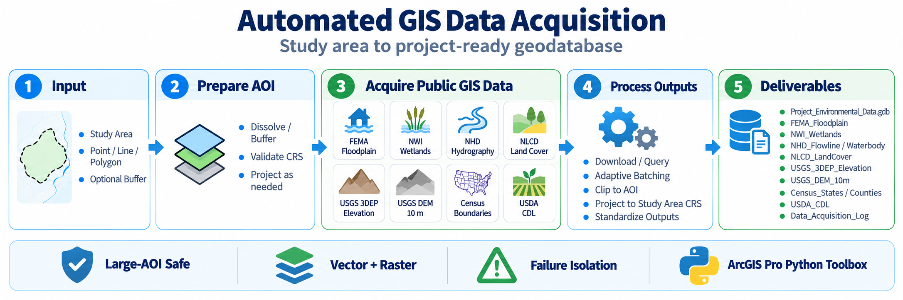
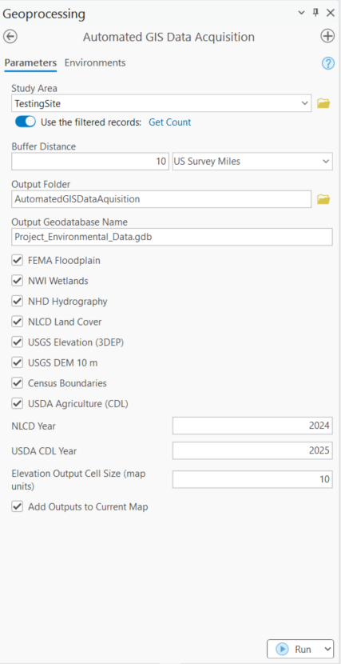

# Automated GIS Data Acquisition

> Turn a project study area into a project-ready GIS data package by automating acquisition, clipping, projection, standardization, logging, QA, and delivery of authoritative public GIS datasets.




## Overview

Environmental and infrastructure GIS projects repeatedly require analysts to visit multiple public-data portals, identify the correct dataset, download it, clip it to a study area, project it, organize outputs, and document what was acquired.

**Automated GIS Data Acquisition** consolidates that workflow into a single ArcGIS Pro Python toolbox.

## Current release

**v1.5.0**

Stable toolbox:

```text
toolboxes/Automated_GIS_Data_Acquisition.pyt
```

## Available datasets

| Dataset | Provider | Status |
|---|---|---:|
| FEMA Flood Hazard Zones | FEMA NFHL | ✅ |
| NWI Wetlands | USFWS | ✅ |
| NHD Flowlines | USGS | ✅ |
| NHD Waterbodies | USGS | ✅* |
| NLCD Land Cover | USGS | ✅ |
| USGS 3DEP Elevation | USGS | ✅ |
| USGS DEM 10 m | USGS | ✅ |
| Census States | U.S. Census Bureau | ✅ |
| Census Counties | U.S. Census Bureau | ✅ |
| USDA Cropland Data Layer | USDA NASS | ✅ |

\* NHD Waterbody is dependent on the public USGS service and can occasionally return HTTP 504 timeouts. The toolbox isolates provider failures so other selected datasets continue processing.

## Tool interface

<p align="center">
  
</p>

### Inputs

- Study Area: point, polyline, or polygon
- Optional buffer distance
- Output folder
- Output geodatabase name
- Dataset selection checkboxes
- NLCD year
- USDA CDL year
- Elevation output cell size
- Option to add outputs to the current ArcGIS Pro map

## Core capabilities

- Public ArcGIS REST and ImageServer acquisition
- Actual-AOI spatial querying for optimized NHD Flowline retrieval
- Adaptive vector batching with recursive subdivision on service failures
- Exact AOI clipping
- Projection to the Study Area coordinate system
- Large-raster automatic tiling and mosaic fallback
- Failure isolation so one provider does not terminate the full run
- Dataset-level provenance
- Automated output QA
- Geodatabase acquisition log
- HTML QA report
- CSV acquisition manifest

## Large-AOI vector handling

Vector services are downloaded in batches. When a request fails, the batch is recursively subdivided until it succeeds or reaches the configured minimum batch size.

Example:

```text
500 IDs
   |
   v
Request fails
   |
   v
250 + 250
   |
   v
Retry each batch
```

NHD Flowlines use an optimized 125-ID starting batch and actual-AOI geometry querying.

## Raster handling

Raster datasets are acquired from public ArcGIS ImageServer services.

For normal-sized requests, the workflow is:

```text
Image Service
     |
     v
Server-side source mosaic
     |
     v
Clip to AOI
     |
     v
Project to Study Area CRS
     |
     v
Single output raster
```

For large AOIs, the toolbox automatically switches to a tiled workflow when the ImageServer export-size limit is exceeded:

```text
Large raster request
        |
        v
ImageServer size limit
        |
        v
Automatic AOI subdivision
        |
        v
Download smaller raster tiles
        |
        v
Mosaic tiles
        |
        v
Project to Study Area CRS
        |
        v
Final raster
```

This large-raster fallback was successfully tested on a B2H-style study area with a 20-mile buffer. A USGS 3DEP request exceeded the service's 8000 × 8000 export limit, was automatically split into four tiles, mosaicked, projected, and completed successfully.

The dedicated **USGS DEM 10 m** option targets an approximately 10-meter output cell size and converts that distance into the Study Area coordinate system's map units when necessary.

## Provenance and QA

Each run creates:

```text
Project_Environmental_Data.gdb
├── downloaded vector/raster datasets
└── Data_Acquisition_Log
```

The `Data_Acquisition_Log` records:

- run ID
- dataset
- acquisition status
- QA status
- source agency
- source service URL
- requested year
- output path and type
- feature count
- raster rows and columns
- raster cell size
- band count
- pixel type
- spatial reference and WKID
- runtime
- acquisition timestamp
- provider/failure message
- QA message

The output folder also receives:

```text
Data_Acquisition_Report.html
Data_Acquisition_Manifest.csv
```

The HTML report provides a human-readable project acquisition and QA summary. The CSV manifest provides a portable provenance record for downstream workflows and deliverables.

## Validation highlights

- FEMA large-area acquisition validated
- NWI large-area acquisition validated
- NHD Flowline optimized with actual-AOI querying and 125-ID batches
- NHD Flowline 10-mile B2H-style test: 2,695 features acquired in 3m 57s with no 504 batch failures
- NLCD acquisition validated
- 3DEP large-raster tiling and mosaic fallback validated
- USGS DEM 10 m large-raster tiling and mosaic fallback validated
- Census boundaries validated
- USDA CDL validated
- Failure isolation validated when a public service timed out

## Installation

1. Download or clone this repository.
2. Open ArcGIS Pro.
3. In the Catalog pane, browse to:

```text
toolboxes/Automated_GIS_Data_Acquisition.pyt
```

4. Expand the toolbox.
5. Open **Automated GIS Data Acquisition**.
6. Select the Study Area and desired public datasets.
7. Run the tool.

No third-party Python package installation is required for the toolbox itself.

## Repository structure

```text
Automated_GIS_Data_Acquisition_v1_5_0/
├── toolboxes/
│   └── Automated_GIS_Data_Acquisition.pyt
├── docs/
│   └── images/
│       ├── automated_gis_data_acquisition_banner.png
│       └── automated_gis_data_acquisition_tool_interface.png
├── examples/
│   └── README.md
├── README.md
├── CHANGELOG.md
├── LICENSE
└── .gitignore
```

## Author

**Dinesh Shrestha**  
GIS Automation & Spatial Analysis Consultant  
ArcGIS Pro • Python • ArcPy • Data Engineering  
Email: dinesh.shrestha015@gmail.com  
Portfolio: dineshrestha.github.io

## License

MIT License.
